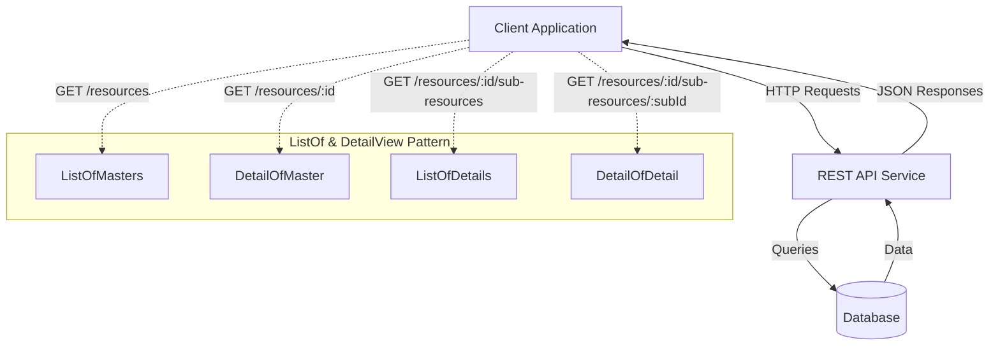
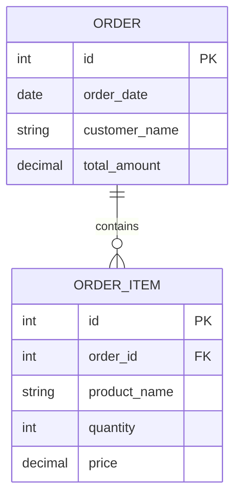
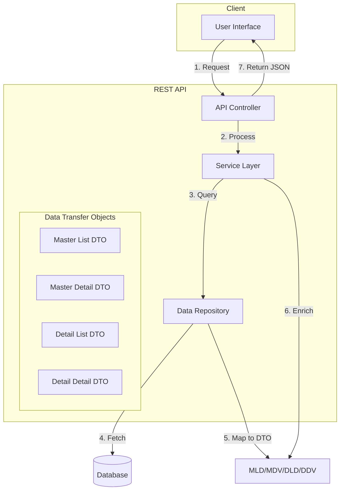
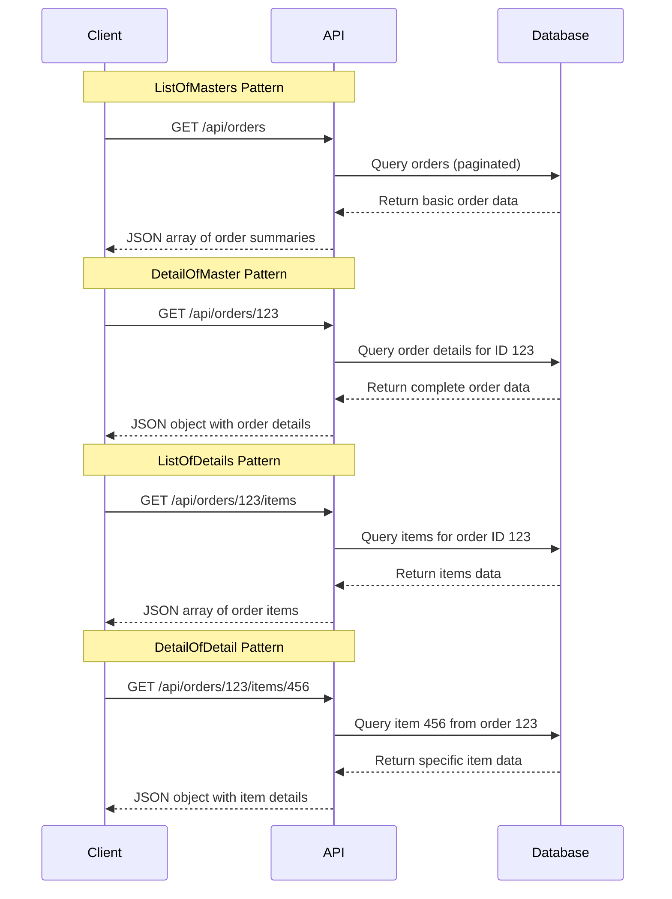
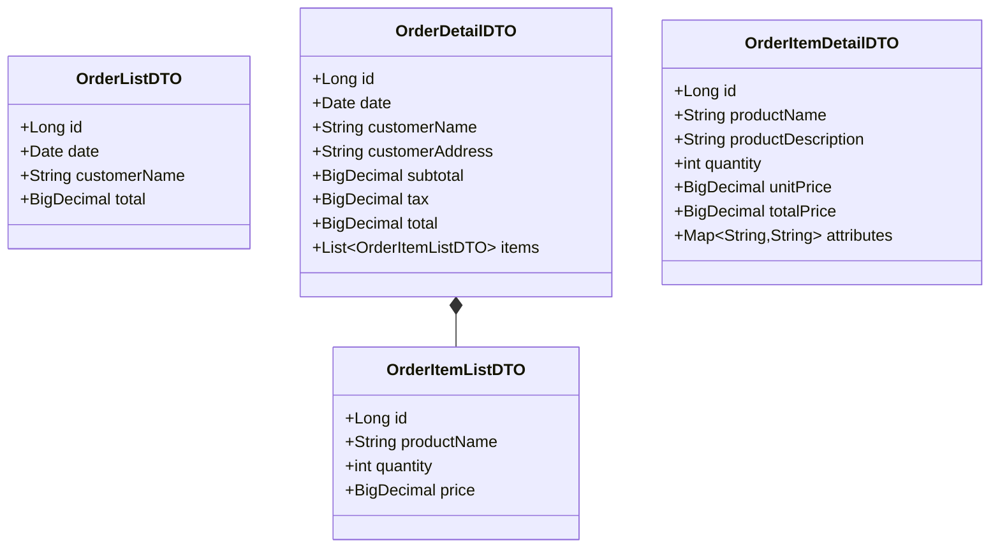
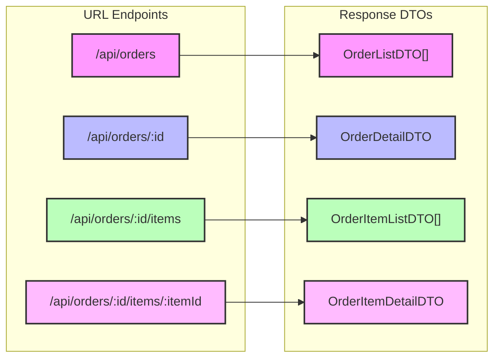
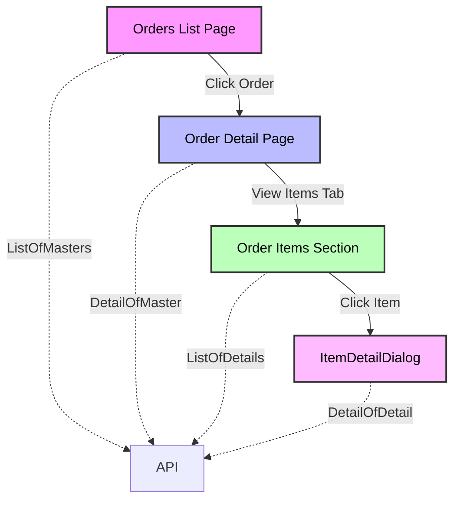
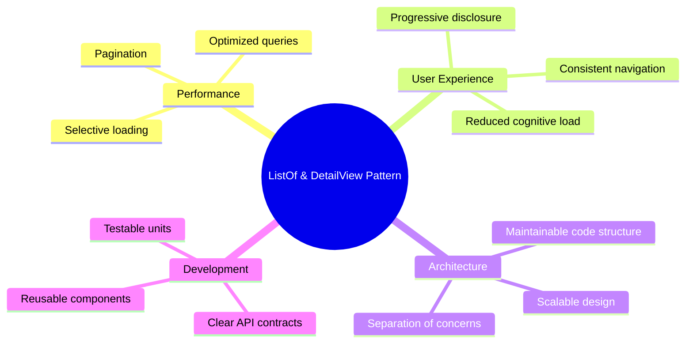
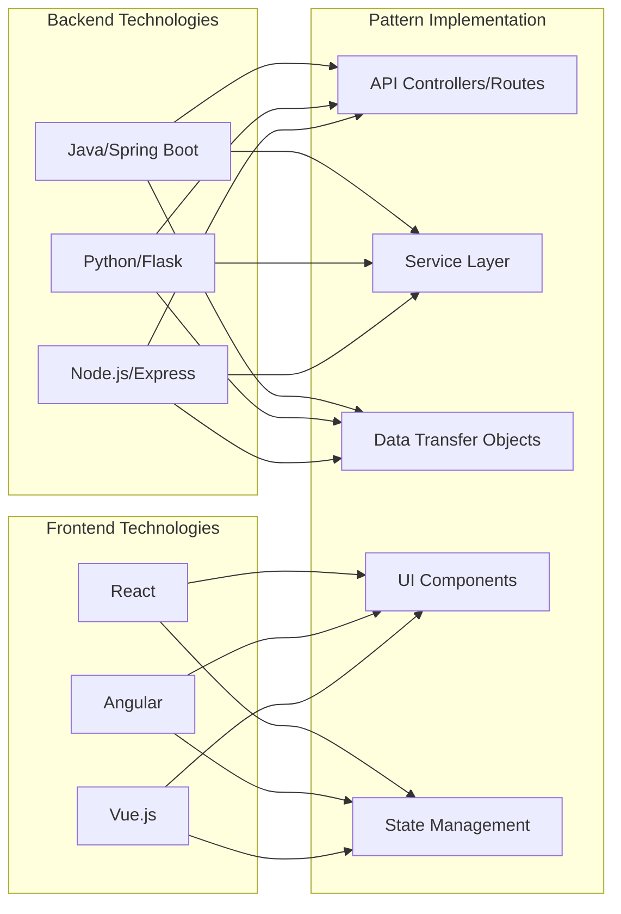

Visualizing REST API with ListOf and DetailView Patterns

This document uses Mermaid diagrams to illustrate how the ListOf and DetailView architectural patterns work within a REST API service.

## API Architecture Overview

## Master-Detail Entity Relationship

## Component Flow for ListOf and DetailView

## Request-Response Flow

## Data Structure Hierarchy

## URL Structure and Response Mapping

## User Interface Navigation Flow

## Key Benefits of the Pattern

## Implementing in Different Technologies

These diagrams provide a comprehensive visualization of how the ListOf and DetailView architectural patterns work within a REST API service, showing the data flow, component relationships, and implementation aspects across different layers of the application.
